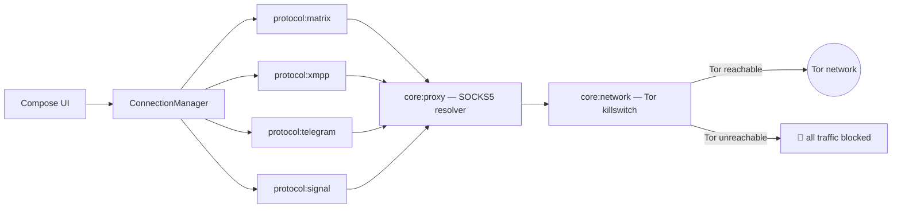

# SecureMessenger

<p align="center">
  <strong>Tor-only, multi-protocol secure messenger for Android — one app, one killswitch, every chat routed through Tor.</strong>
</p>

<p align="center">
  <a href="LICENSE"></a>
  <a href="https://github.com/LTechnologies0/SecureMessenger/actions/workflows/ci.yml"></a>
  <a href="https://github.com/LTechnologies0/SecureMessenger/releases"></a>
  <a href="https://ltechnologies0.github.io/SecureMessenger/"></a>
  
  
</p>

**SecureMessenger** is an open-source Android app that lets you chat over **Matrix, XMPP, Telegram, and Signal** from a single app — with **every byte of network traffic forced through Tor**. Part of the [OnionPhone](https://onionphone.org) app family.

> If Tor is unreachable, a killswitch blocks all connections. There is no "send over clearnet" fallback — by design.

---

## Table of contents

- [Features](#features)
- [Architecture](#architecture)
- [Install from GitHub Releases](#install-from-github-releases)
- [Build it yourself](#build-it-yourself)
- [API documentation (KDoc)](#api-documentation-kdoc)
- [Security](#security)
- [Contributing](#contributing)
- [License](#license)

---

## Features

| Feature | Description |
|---------|-------------|
| **Multi-protocol** | Matrix, XMPP, Telegram, Signal accounts side by side in one app |
| **Tor-only networking** | Every protocol, including in-app WebViews, is force-routed through a SOCKS5 → Tor proxy; a killswitch blocks traffic if Tor is down |
| **Account registration** | Create new Matrix accounts (UIA dummy/token stages inline, WebView fallback for captcha/email/terms) and XMPP accounts (XEP-0077 in-band registration with dynamic extra fields) — no browser needed for the common case |
| **Matrix well-known discovery** | Automatically resolves delegated homeservers via `.well-known/matrix/client` |
| **Per-account Tor circuit isolation** | XMPP connections use per-account SOCKS5 stream isolation so different accounts don't share a Tor circuit |
| **Encrypted local storage** | Account credentials stored via Android Keystore-backed encrypted storage |
| **Material 3 UI** | Jetpack Compose with adaptive navigation |

### Network flow



---

## Architecture

12-module Gradle project — see [docs/ARCHITECTURE.md](docs/ARCHITECTURE.md) for the full module graph and registration flow details.

```
:app
 ├── :core:model     (shared data classes)
 ├── :core:proxy     (SOCKS5 resolution)
 ├── :core:network   (Tor killswitch, WebView proxying)
 ├── :core:security  (encrypted credential storage)
 ├── :data           (persistence)
 └── :protocol:api   (MessengerProtocol interface)
      ├── :protocol:xmpp      (Smack)
      ├── :protocol:matrix    (raw CS API + Trixnity)
      ├── :protocol:telegram  (TDLib JNI)
      └── :protocol:signal
```

| Layer | Technologies |
|-------|--------------|
| UI | Jetpack Compose, Material 3, Navigation Compose |
| DI | Dagger Hilt |
| Async | Kotlin Coroutines + Flow |
| Networking | Ktor (Matrix), OkHttp/WebView (proxied), Smack (XMPP), TDLib (Telegram) |
| Storage security | AndroidX Security Crypto (Keystore-backed encrypted storage) |
| Proxy | SOCKS5 → Tor, enforced at the network layer, not just per-request |

---

## Install from GitHub Releases

1. Open **[Releases](https://github.com/LTechnologies0/SecureMessenger/releases)**.
2. Download the APK matching your device CPU:

   | APK suffix | Devices |
   |------------|---------|
   | `arm64-v8a` | Most modern phones (2017+) |
   | `armeabi-v7a` | Older 32-bit ARM phones |
   | `x86_64` | Emulators, some tablets |
   | `x86` | Older emulators |

3. Enable **Install unknown apps** for your browser/files app.
4. Install the APK.
5. On first launch, add a Telegram account requires your own free API credentials from [my.telegram.org](https://my.telegram.org) if you build from source (release APKs from CI already bundle build-time credentials configured by the maintainer).

> Release APKs are signed with the project release key when CI secrets are configured. Verify the signature with `apksigner verify`.

---

## Build it yourself

### Prerequisites

| Tool | Version |
|------|---------|
| JDK | **21** (Temurin recommended) |
| Android SDK | API **37**, Build-Tools **36+** |
| Android NDK | **26.1.10909125** (only needed for Telegram/TDLib — see [docs/tdlib-build.md](docs/tdlib-build.md)) |
| Gradle | **9.x** (wrapper included) |

Set `ANDROID_HOME` / `ANDROID_SDK_ROOT` and create `local.properties` from the example:

```bash
cp local.properties.example local.properties
# Edit sdk.dir / ndk.dir, and telegram.api.id / telegram.api.hash (see below)
```

Telegram support needs your own free API credentials from [my.telegram.org](https://my.telegram.org) — see [docs/tdlib-build.md](docs/tdlib-build.md) for the full TDLib setup (prebuilt AAR fetch or build-from-source).

### One-shot commands by OS

<details>
<summary><strong>Linux / macOS</strong></summary>

```bash
# Clone
git clone https://github.com/LTechnologies0/SecureMessenger.git && cd SecureMessenger
cp local.properties.example local.properties   # then edit paths/credentials

# Debug APK (arm64-v8a, fastest)
./gradlew :app:assembleDebug

# All unit tests
./gradlew test

# Release APKs — all 4 ABIs (unsigned without keystore)
./gradlew :app:assembleRelease

# Release APKs — signed locally
cp keystore.properties.example keystore.properties
# Edit keystore.properties, then:
./gradlew :app:assembleRelease

# Install debug on connected device
./gradlew :app:installDebug

# API documentation
./gradlew dokkaGenerate
# → build/dokka/html/index.html
```

</details>

<details>
<summary><strong>Windows (PowerShell)</strong></summary>

```powershell
git clone https://github.com/LTechnologies0/SecureMessenger.git; cd SecureMessenger
Copy-Item local.properties.example local.properties   # then edit paths/credentials

# Debug APK
.\gradlew.bat :app:assembleDebug

# Tests
.\gradlew.bat test

# Release (all ABIs)
.\gradlew.bat :app:assembleRelease

# Install debug
.\gradlew.bat :app:installDebug

# Docs
.\gradlew.bat dokkaGenerate
```

</details>

### Output paths

| Task | Output |
|------|--------|
| `assembleDebug` | `app/build/outputs/apk/debug/app-<abi>-debug.apk` |
| `assembleRelease` | `app/build/outputs/apk/release/app-<abi>-release.apk` |
| `dokkaGenerate` | `build/dokka/html/index.html` |
| `test` | `**/build/reports/tests/` |

### Local release signing

```bash
bash scripts/generate-release-keystore.sh
cp keystore.properties.example keystore.properties
# Edit paths/passwords — never commit these files
./gradlew :app:assembleRelease
```

---

## API documentation (KDoc)

Public APIs are documented with **KDoc** in source. HTML reference is generated with **[Dokka](https://kotlinlang.org/docs/dokka-introduction.html)**:

```bash
./gradlew dokkaGenerate
# → build/dokka/html/index.html
```

**Live docs** (auto-deployed on push to `main`): [ltechnologies0.github.io/SecureMessenger](https://ltechnologies0.github.io/SecureMessenger/)

---

## Security

- **Tor-only, always**: see [SECURITY.md](SECURITY.md) and [docs/ARCHITECTURE.md](docs/ARCHITECTURE.md) for the full network-enforcement design.
- **No secrets in repo**: `keystore.properties`, `local.properties`, and keystores are gitignored.
- **Encrypted credential storage**: account secrets stored via Keystore-backed encrypted storage.
- **CI signing**: GitHub Actions secrets only — see [SECURITY.md](SECURITY.md).

| GitHub secret | Purpose |
|---------------|---------|
| `RELEASE_KEYSTORE_BASE64` | Base64-encoded keystore |
| `RELEASE_KEYSTORE_PASSWORD` | Keystore password |
| `RELEASE_KEY_ALIAS` | Key alias |
| `RELEASE_KEY_PASSWORD` | Key password |

Enable in repo settings: Dependabot alerts, secret scanning, push protection, CodeQL.

---

## Contributing

1. Fork and create a feature branch from `main`.
2. Run `./gradlew test :app:assembleDebug` before pushing.
3. Add KDoc for new public APIs.
4. Open a PR — CI runs tests, debug build, CodeQL, and dependency review.

See [CHANGELOG.md](CHANGELOG.md) for release history.

---

## License

**GPL-3.0-or-later** — see [LICENSE](LICENSE).

Smack, Trixnity, TDLib, and other third-party SDKs are licensed separately under their own terms.
