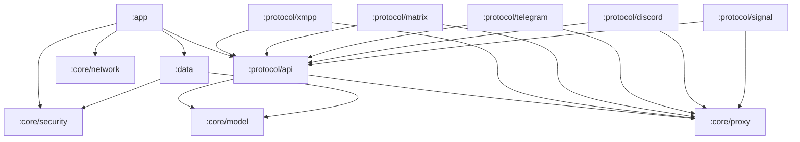

# SecureMessenger — Architecture

SecureMessenger is a **12-module** Gradle project. Every network path — regardless of protocol — flows through a single Tor SOCKS5 proxy layer enforced by `core/network`. Protocol adapters never talk to the internet directly.

## Module graph



## Module responsibilities

| Module | Role |
|--------|------|
| `:app` | Compose UI (accounts, conversations, chat), navigation, `MainViewModel`, `ConnectionManager` orchestration |
| `:core:model` | Shared data classes: `AccountCredentials`, `ProxyConfig`, `RegistrationRequest`/`RegistrationResult`, protocol enums |
| `:core:proxy` | SOCKS5 endpoint resolution and reachability probing shared by every protocol adapter |
| `:core:network` | Tor-only enforcement (`NetworkGuard`), killswitch, WebView SOCKS routing (`androidx.webkit.ProxyController`) |
| `:core:security` | `EncryptedCredentialStore` and other Keystore-backed secret storage |
| `:data` | Persistence for accounts, conversations, and message caches |
| `:protocol:api` | `MessengerProtocol` interface every adapter implements — connect, disconnect, send, register |
| `:protocol:xmpp` | Smack-based XMPP client (`SmackClientFacade`), XEP-0077 registration (`XmppRegistration`) |
| `:protocol:matrix` | Raw Matrix Client-Server API client, well-known discovery, UIA registration + WebView fallback |
| `:protocol:telegram` | TDLib JNI bindings (see [docs/tdlib-build.md](tdlib-build.md)) |
| `:protocol:discord` | Discord client adapter |
| `:protocol:signal` | Signal protocol adapter |

## Network flow (every protocol)

```
Protocol adapter (Matrix / XMPP / Telegram / Discord / Signal)
        ↓
core/proxy — SocksEndpointResolver (resolve reachable Tor SOCKS host:port)
        ↓
core/network — NetworkGuard killswitch (blocks all traffic if Tor is unavailable)
        ↓
Tor SOCKS5 proxy → Tor network → destination server
```

Matrix and XMPP UIA/registration steps that require a browser (captcha, email verification, terms acceptance) open an in-app WebView that is force-routed through the same Tor proxy via `androidx.webkit.ProxyController` — no direct network path ever exists for any component, including the WebView.

## Registration flows

- **Matrix**: `MatrixRegistration` calls `/_matrix/client/v3/register` directly (bypassing Trixnity for this one step, for full control over User-Interactive Auth). Supports `m.login.dummy` and `m.login.registration_token` inline; any other stage (captcha, email, terms) falls back to `RegistrationWebViewDialog`.
- **XMPP**: `XmppRegistration` uses Smack's `AccountManager` (XEP-0077) to probe `getAccountAttributes()` / `getAccountInstructions()` after the user enters a domain, then dynamically renders any additional required fields.
- **XMPP Tor stream isolation**: `SmackClientFacade` and `XmppRegistration` always pass a non-null SOCKS5 username/password to Smack's proxy client. Smack advertises both no-auth and username/password SOCKS5 methods; Tor's `SocksPort` commonly selects username/password purely as a stream-isolation token. Supplying one (the bare JID) both fixes the handshake and gives each account its own Tor circuit.

## Signing and CI

- `gradle/abi-release.gradle` — per-ABI release splits (`armeabi-v7a`, `arm64-v8a`, `x86`, `x86_64`)
- `gradle/release-signing.gradle` — resolves signing credentials from `keystore.properties` (local) or `RELEASE_KEYSTORE_*` environment variables (CI); unsigned if neither is present
- `.github/workflows/release.yml` — builds and signs all four ABIs, publishes to GitHub Releases with SHA-256 checksums
