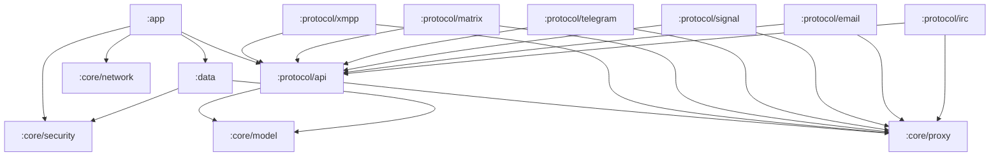

# SecureMessenger — Architecture

SecureMessenger is a multi-module Gradle project (first-party app + core + data + protocol adapters; Signal vendor modules are separate). Network traffic is **clearnet by default**. When the user enables Tor, adapters route through a Tor SOCKS5 endpoint (OnionVPN PAC bridge or custom SOCKS), gated by `core/network` (`NetworkGuard`).

## Module graph


```mermaid
flowchart TB
    APP[:app]
    DATA[:data]
    NET[:core/network]
    PROXY[:core/proxy]
    SEC[:core/security]
    MODEL[:core/model]
    PAPI[:protocol/api]
    XMPP[:protocol/xmpp]
    MATRIX[:protocol/matrix]
    TG[:protocol/telegram]
    SIGNAL[:protocol/signal]
    EMAIL[:protocol/email]
    IRC[:protocol/irc]

    APP --> DATA
    APP --> PAPI
    APP --> NET
    APP --> SEC
    XMPP --> PAPI
    MATRIX --> PAPI
    TG --> PAPI
    SIGNAL --> PAPI
    EMAIL --> PAPI
    IRC --> PAPI
    PAPI --> MODEL
    PAPI --> PROXY
    XMPP --> PROXY
    MATRIX --> PROXY
    TG --> PROXY
    SIGNAL --> PROXY
    EMAIL --> PROXY
    IRC --> PROXY
    DATA --> SEC
    DATA --> MODEL
```

## Protocol feature grid

| Protocole | Connexion | Envoi | Réception | Groupes | Médias | E2EE | Inscription |
|-----------|-----------|-------|-----------|---------|--------|------|-------------|
| XMPP | OK | OK | OK | MUC + bookmarks | HTTP upload + OOB/aesgcm | OMEMO 1:1+MUC (fail-closed) | OK (Tor) |
| Matrix | OK + SSO | OK | OK | OK | Trixnity upload + mxc download | Megolm (H2 `fromStore`, fail-closed) | OK (Tor) |
| Telegram | OK* | OK | OK | OK | TDLib send/receive | MTProto (cloud)† | Phone auth (TDLib)* |
| Signal | OK | OK | OK WS | GV2 sender-key (+ encrypted fan-out) | CDN upload/download | libsignal store (sessions/SK) | OK (Tor) |
| Email | OK | SMTP/JMAP | IMAP IDLE / POP3 / JMAP | — | MIME attachments | — (OpenPGP out of scope) | — |
| IRC | OK | PRIVMSG | PRIVMSG + system | Channels | — | — | — |

\* Requires prebuilt TDLib AAR with `libtdjni.so` for packaged ABIs ([docs/tdlib-build.md](tdlib-build.md)). Debug APKs include `arm64-v8a` + `x86_64` by default (Waydroid/emulators). Telegram “inscription” is TDLib phone/SMS auth, not `MessengerProtocol.register`.

† Telegram cloud chats use MTProto (client↔server). Secret chats are not exposed in this build.

Email details: [docs/email.md](email.md). Password auth only; autoconfig via Thunderbird ISPDB + DNS SRV (DoH).

IRC details: [docs/irc.md](irc.md). Kitteh client; TLS or cleartext; NickServ / SASL PLAIN; Tor SOCKS5 when enabled.

Toutes les inscriptions et le trafic protocolaire passent par Tor (SOCKS5 fail-closed) **lorsque Tor est activé**. Discord a été retiré du projet.

Matrix E2EE is **fail-closed**: connect / SSO succeeds only when Trixnity is live; plaintext HTTP `/sync` is stopped once Trixnity owns the session. OIDC homeservers use `m.login.sso` → Tor WebView → one-shot `loginToken` → soft-login (never reuse `m.login.token` with an access token).

XMPP OMEMO is **fail-closed** when the peer/room advertises OMEMO: encrypt failure aborts send (no cleartext fallback). Contacts/rooms without OMEMO still use plaintext XMPP (protocol limitation).

Signal GV2 prefers sender keys; if endorsements/certificates are unavailable it fans out **encrypted** per-recipient Signal messages (not cleartext).

## Module responsibilities

| Module | Role |
|--------|------|
| `:app` | Compose UI (accounts, conversations, chat), navigation, `MainViewModel`, `ConnectionManager` orchestration |
| `:core:model` | Shared data classes: `AccountCredentials`, `ProxyConfig`, `RegistrationRequest`/`RegistrationResult`, protocol enums |
| `:core:proxy` | SOCKS5 endpoint resolution and reachability probing shared by every protocol adapter |
| `:core:network` | Optional Tor gate (`NetworkGuard`), clearnet HTTP clients by default, WebView SOCKS when Tor enabled |
| `:core:security` | `EncryptedCredentialStore` and other Keystore-backed secret storage |
| `:data` | Persistence for accounts, conversations, and message caches |
| `:protocol:api` | `MessengerProtocol` interface every adapter implements — connect, disconnect, send, register |
| `:protocol:xmpp` | Smack-based XMPP client (`SmackClientFacade`), XEP-0077 registration (`XmppRegistration`) |
| `:protocol:matrix` | Trixnity client (E2EE) + raw CS API for register/UIA/SSO token; well-known discovery |
| `:protocol:telegram` | TDLib JNI bindings (see [docs/tdlib-build.md](tdlib-build.md)) |
| `:protocol:signal` | Signal adapter (`libsignal-service` + `libsignal-client`) — see [docs/signal-vendor.md](signal-vendor.md) |
| `:protocol:email` | Angus Mail IMAP/POP3/SMTP + JMAP HTTPS — see [docs/email.md](email.md) |
| `:protocol:irc` | Kitteh IRC (TLS/NickServ/SASL, channels + DMs) — see [docs/irc.md](irc.md) |

## Network flow (every protocol)

```
Protocol adapter (Matrix / XMPP / Telegram / Signal / Email / IRC)
        ↓
core/proxy — OnionVpnPacClient (GET http://127.0.0.1:18201/onionvpn.pac)
           → SOCKS5 127.0.0.1:18202 (DNSCrypt→Tor bridge)
        ↓
core/network — NetworkGuard (blocks only when Tor is opted-in and SOCKS is down)
        ↓
OnionVPN PAC bridge → Tor → destination
```

\* Default Tor provider is OnionVPN PAC (`:18201` / SOCKS `:18202`). Custom SOCKS remains selectable. Orbot / InviZible removed. When Tor is on, Signal uses `SignalSocksHolder` like other protocols; Email uses Angus `mail.*.socks.*` properties and SOCKS OkHttp for JMAP; IRC uses Kitteh `ProxyType.SOCKS_5`.

Matrix and XMPP UIA/registration steps that require a browser (captcha, email verification, terms acceptance) open an in-app WebView that is force-routed through the same Tor proxy via `androidx.webkit.ProxyController` when Tor is enabled.

## Registration flows

- **Matrix**: `MatrixRegistration` calls `/_matrix/client/v3/register` directly (bypassing Trixnity for this one step, for full control over User-Interactive Auth). Supports `m.login.dummy` and `m.login.registration_token` inline; any other stage (captcha, email, terms) falls back to `RegistrationWebViewDialog`.
- **XMPP**: `XmppRegistration` uses Smack's `AccountManager` (XEP-0077) to probe `getAccountAttributes()` / `getAccountInstructions()` after the user enters a domain, then dynamically renders any additional required fields.
- **XMPP Tor stream isolation**: `SmackClientFacade` and `XmppRegistration` always pass a non-null SOCKS5 username/password to Smack's proxy client. Smack advertises both no-auth and username/password SOCKS5 methods; Tor's `SocksPort` commonly selects username/password purely as a stream-isolation token. Supplying one (the bare JID) both fixes the handshake and gives each account its own Tor circuit.
- **Telegram / Signal / Email / IRC**: no `MessengerProtocol.register` path (Telegram/Signal use dedicated login UIs; Email/IRC are login-only).

## Signing and CI

- `gradle/abi-release.gradle` — per-ABI release splits (`armeabi-v7a`, `arm64-v8a`, `x86`, `x86_64`)
- `gradle/release-signing.gradle` — resolves signing credentials from `keystore.properties` (local) or `RELEASE_KEYSTORE_*` environment variables (CI); unsigned if neither is present
- `.github/workflows/release.yml` — builds and signs all four ABIs, publishes to GitHub Releases with SHA-256 checksums
